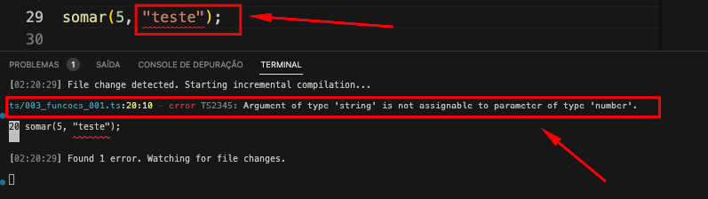
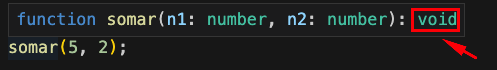
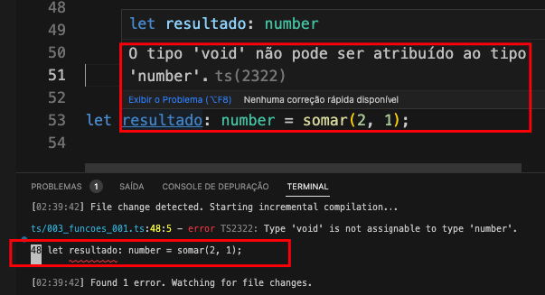

<center>

[🏠 Home](../index.md)

</center>

#

<h1 align="center">Funções</h1>

> Uma função é um "bloco de código" que resolve um dado problema específico, que possui um nome associado e que pode ser chamado quando necessário. Ao final da função a linha de execução retorna para quem chamou a função. fonte: https://wiki.sj.ifsc.edu.br/index.php/Funções_-_Programação_1_-_Engenharia

### Declaração

Para declararmos uma função em TS utilizamos a sintaxe:

```typescript
function nomeDaFuncao(parametro1: tipoVar, parametro2: tipoVar): tipoRetorno {
  //código a ser executado
}
```

Vejamos um exemplo prático da declaração de uma função:

```typescript
function somar(n1: number, n2: number) {
  console.log(n1 + n2);
}
```

### Utilizando funções

Para chamar uma função, é utilizado a seguinte sintaxe:

```typescript
// nomeFuncao(parametro1, parametro2, ...,  parametroX);
somar(2, 3); //saída 5
```

Fazer a tipagem correta dos parâmetros é uma boa prática, pois traz maior controle e facilita a manutenção do código. Por exemplo, o que acontece se tentarmos passar uma **string** para a função **somar**?

```typescript
somar(5, "teste");
```

O VS da um **highlight** na passagem errada de parâmetro e o terminal da um erro de compilação, conforme imagem a seguir:

<div align="center">



</div>

### Inferência

Se não definirmos o tipo de retorno, ele é atribuido por meio de inferência, por exemplo, em **somar** é atribuido o tipo **void** pois a função não possui nennhum retorno, podemos ver isso claramente ao passar o mouse sobre a função e ver o que VS informa sobre ela, conforme a imagem a seguir:

<div align="center">



</div>

A inferência no tipo de retorno traz grandes vantagens, por exemplo se um programador no futuro tentar armazenar o retorno da função somar em uma variável do tipo inteiro, ocorre tanto um **highlight** como um erro de compilação.

```typescript
let resultado: number = somar(5, 2);
```

Exemplo dos erros a seguir:

<div align="center">



</div>

### Parâmetros opcionais

Podemos definir também parâmetros opcionais na assinatura da função, basta utilizarmos o modificador **?**, conforme exemplo a seguir:

```typescript
function retornaMensagem(nome: string, titulo?: string): string {
  return `Bem vindo! ${titulo} ${nome}.`;
}
console.log(retornaMensagem("Abgail", "Dra")); //saída Bem vindo! Dra Abgail.
console.log(retornaMensagem("Bento")); //saída Bem vindo! undefined Bento.
```

Apesar de não acontecer nenhum erro de compilação ou **highlight** ao não passarmos o parâmetro **titulo**, o nosso código está falho, pois exibe undefined para o usuário.

Para aprimorarmos nosso código vamos adicionar uma condicional

```typescript
function retornaMensagem(nome: string, titulo?: string): string {
  if (titulo !== undefined) {
    return `Bem vindo! ${titulo} ${nome}.`;
  } else {
    return `Bem vindo! ${nome}.`;
  }
}
console.log(retornaMensagem("Abgail", "Dra")); //saída Bem vindo! Dra Abgail.
console.log(retornaMensagem("Bento")); //saída Bem vindo! Bento.
```

Ao analisar esse código, como podemos otimiza-lo?Sim, conforme exemplo a seguir:

```typescript
function retornaMensagem(nome: string, titulo?: string): string {
  if (titulo !== undefined) {
    return `Bem vindo! ${titulo} ${nome}.`;
  }
  return `Bem vindo! ${nome}.`;
}
console.log(retornaMensagem("Abgail", "Dra")); //saída Bem vindo! Dra Abgail.
console.log(retornaMensagem("Bento")); //saída Bem vindo! Bento.
```

A medida que vamos desenvolvendo nosso projeto vamos criando cada vez mais blocos de códigos mais complexos. Para facilitar a manutenção e evitar o retrabalho as funções são de grande ajuda. A seguir um exemplo de função que recebe uma array de strings e retorna o tamanho da maior.

```typescript
const capitaes = ["Picard", "Kirk", "Janeway", "pike"];

function getMaiorTamanho(nomes: string[]) {
  let maiorNome = 0;
  for (let i = 0; i < nomes.length; i++) {
    if (nomes[i].length > maiorNome) {
      maiorNome = nomes[i].length;
    }
  }
  return maiorNome;
}
console.log(`Tamanho do maior nome ${getMaiorTamanho(capitaes)}`);
```

<h2 align="center"> 
	🎲 Hands on 003 🎲
</h2>

As respostas para as perguntas a seguir devem ser de acordo com o contexto do seu projeto.

1. Com base no seu projeto crie uma função que retorna uma mensagem de boas vindas, a função deve receber no minimo 3 parâmetros, um deles deve ser opcional.

2. Crie uma função chamada getNome que receba como parâmetro o id do produto/serviço, a função deve retornar o nome de acordo com o id informado. A função deve ter pelo menos 5 itens cadastrados. O id dos produtos devem ser iniciados a partir da posição 1.

3. Crie uma função chamada getPreco que receba como parâmetro o id do produto/serviço, a função deve retornar o preço de acordo com o id informado. A função deve ter pelo menos 5 itens cadastrados. O id dos produtos devem ser iniciados a partir da posição 1.

4. Fazendo uso das funçoes getNome e getPreco, crie uma função que receba o id do produto/serviço e retorne o seu valor inflacionado de 5% se o valor for igual ou menor que 100 ou de 10% caso seja maior. Em seguida exiba no console.

5. Fazendo uso das funçoes getNome e getPreco, crie uma função que receba o id do produto/serviço e um valor de desconto opcional. A função deve exibir no console uma mensagem personalizada com informado id do produto, nome, valor normal e valor com desconto (caso tenha sido informado desconto).

#

<center>

[🏠 Home](../index.md)

</center>
