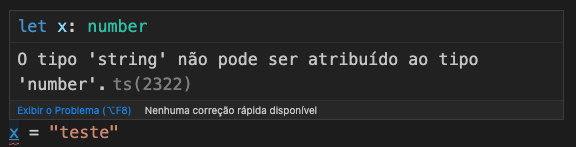
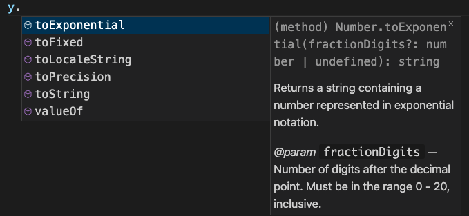

<center>

[🏠 Home](../index.md)

</center>

#

<h1 align="center">Introdução a tipos primitivos</h1>

Iremos trabalhar incialmente com os tipos primitivos:
**number, string e boolean.**

Ao criar uma variável de um desses tipos, é possível garantir que o dado recebido seja de acordo com o tipo declarado. Ao declararmos um tipo garantimos que o valor da variável seja do tipo definido e que que só possa ser chamado métodos relativos ao tipo definido.

Para declararmos uma variável em TS, usamos a seguinte estrutura:

```typescript
// tipoDoEscopo nomeVariavel: tipo = valor;
let x: number = 10;
//Atualizado valor da variável x
x = 7;
```

Agora ao atribuir valores a variável **x**, caso seja informado um valor diferente do tipo **number** a IDE emite um highlight (destaque) e é informado um erro no transpilador, conforme imagens a seguir:

<div align="center">



</div>
</br>
<center>Mensagem Visual Studio Code</center>

<div align="center">


</div>
<center>Mensagem do Typecript no terminal</center>

Para verificar o tipo de uma variável podemos usar o comando **typeof** conforme o exemplo a seguir:

```typescript
console.log(typeof x); //saída number
```

Em TS utilizamos o tipo inteiro tanto para valores inteiros e com casas decimais

```typescript
let y: number = 10.3333;
console.log(y);
console.log(typeof y);
```

Conforme a imagem a seguir o autocomplete do VS sugege somente métodos referente ao ao tipo da variável.

<div align="center">



</div>
<center>Mensagem do Typecript no terminal</center>

Caso seja usado um método invalido são retornado erros tanto na IDE como no terminal.

No código a seguir é apresentado o uso dos tipos **string e boolean**.

```typescript
let texto: string = "Minha primeira string.";
let status: boolean = true;
console.log(typeof texto);
console.log(typeof status);
console.log(texto);
console.log(status);
```

<h2 align="center"> 
	🎲 Hands on 001 🎲
</h2>

1. Veja 3 funções dos tipos **number e string** exiba no console a explicação de cada uma e mostre exemplos de utilização.

2. Quais são os outros tipos de dados que o TS suporta? Crie um arquivo TS e exiba no console o nome de cada um e uma explicação da sua utilização.

#

<center>

[🏠 Home](../index.md)

</center>
