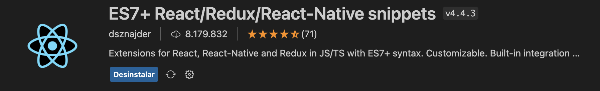
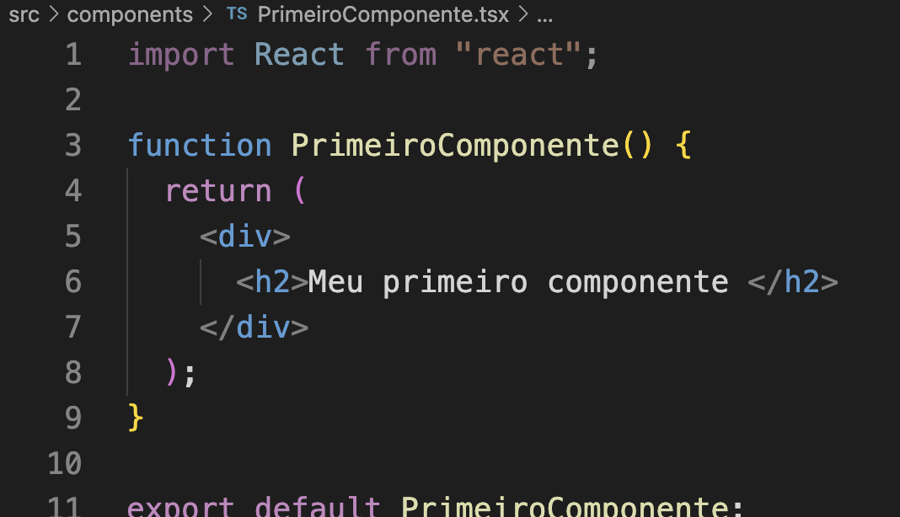

[🏠 Home](../index.md)

#

<h1 align="center">Criando Primeiro Componente React</h1>

## O que é?

> Os componentes permitem que você divida a interface do usuário em partes independentes e reutilizáveis e pense em cada parte isoladamente. Esta página fornece uma introdução à ideia de componentes. Você pode encontrar uma referência detalhada da API do componente aqui.
> Conceitualmente, componentes são como funções JavaScript. Eles aceitam entradas arbitrárias (chamadas “props”) e retornam elementos React que descrevem o que deve aparecer na tela.
>
> Fonte: https://pt-br.legacy.reactjs.org/docs/components-and-props.html#:~:text=Conceitualmente%2C%20componentes%20são%20como%20funções,que%20deve%20aparecer%20na%20tela.

## Como criar nosso primeiro componente?

Para otimizar o desenvolvimento vamos usar a extensão **ES7+ React/Redux/React-Native Snippets**, que facilita a geração de código e configuração dos nossos componentes.

Então dentro da pasta SRC criamos uma pasta chamada **components**. E nela iremos inserir os componentes criados.

Vamos criar um arquivo chamado PrimeiroComponente.tsx, e dentro dele digitamos o atalho: tsrfce. Ao fazermos isso é gerado automáticamente o código básico do nosso componente, conforme imagem em anexo, incialmente vamos remover alguns trechos de código e deixar conforme o exemplo:

E para utilizarmos precisamos apenas fazer a importação e

<h2 align="center"> 
	🎲 Hands on R002 🎲
</h2>

1. Transforme em componentes as seções criadas no Hands on R001.

[🏠 Home](../index.md)

