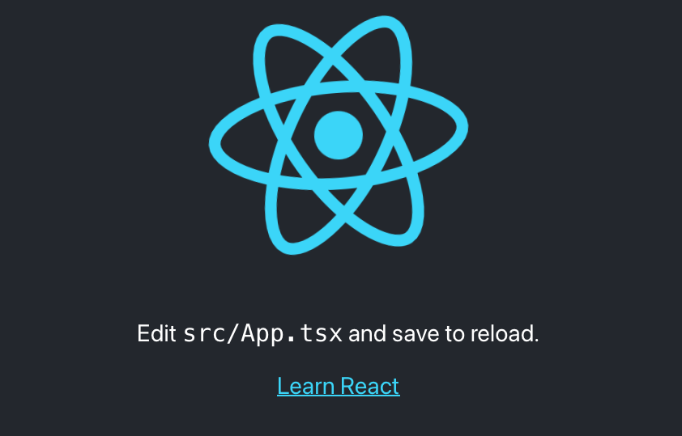
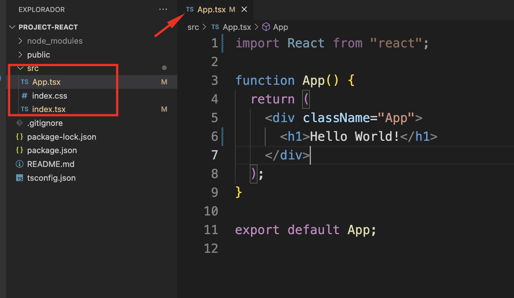
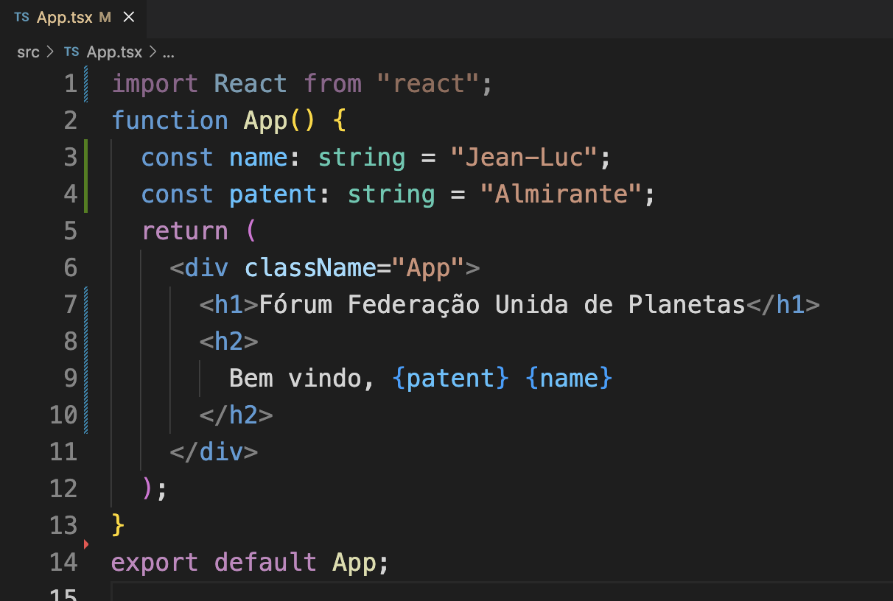
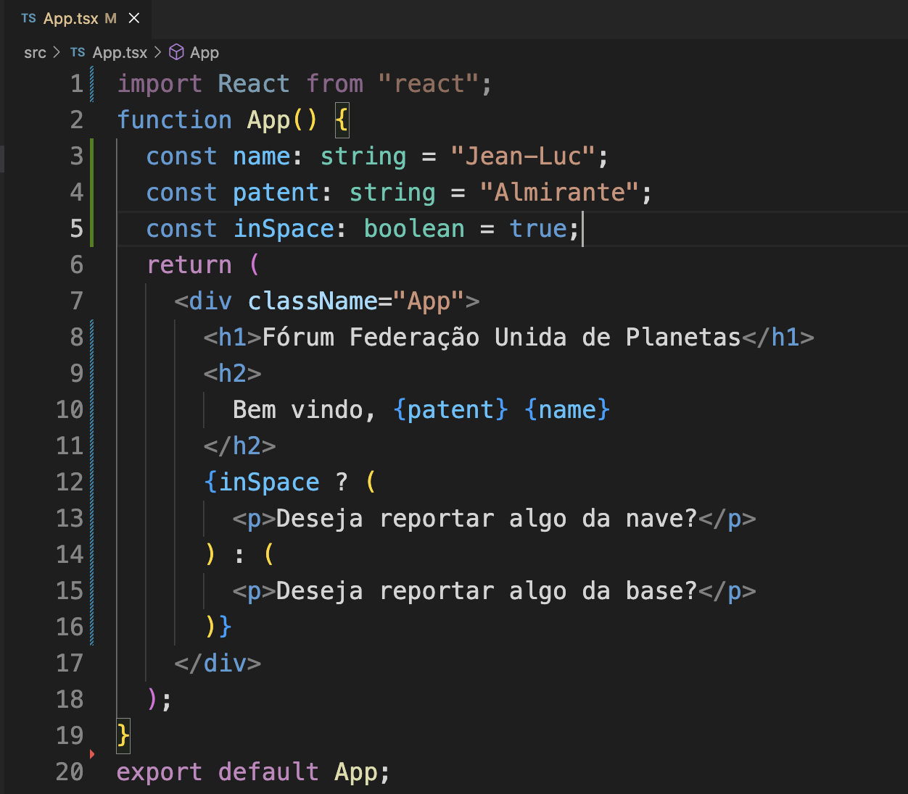

<center>

[🏠 Home](../index.md)

</center>

#

<h1 align="center">Introdução React</h1>

## O que é?

> Segundo a proprio site do React, ele é uma biblioteca para criação de interfaces web e nativas. Que permite a criação de interfaces personalizada por meio de peças/itens chamados componentes.
>
> Sendo projeto para permitir a combinação perfeita de componentes escritos por pessoas, equipes e organizações independentes.
>
> Fonte: https://react.dev

## O que estão falando sobre React?

- Canal Código Fonte TV -[React JS // Dicionário do Programador](https://youtu.be/NhUr8cwDiiM).

- Canal DevMedia -[React - 6 razões para estudar em 2023](https://youtu.be/PfJ96pHdI4k).

- DevPleno -[React ou React-Native? Série ReactJS](https://youtu.be/H0rnlBivakY).

- Alura -[Diferenças entre React e React Native](https://youtu.be/2-OAUXA4IcE).

## Primeiro projeto com ReactJs

Para criar o nosso primeiro projeto vamos utilizar o NPX. Que é:

> Uma ferramenta de interface de linha de comando, que vem integrado ao NPM. Cujo propósito é facilitar a instalação e o gerenciamento de dependências hospedadas no registro do npm.
>
> Fonte: https://www.freecodecamp.org/portuguese/news/npm-x-npx-qual-e-a-diferenca/

Para criar nosso projeto devemos executar o seguinte comando:

```shell
 npx create-react-app projeto_01 --template typescript
```

O comando tem a seguinte estrutura:

- npx: Gererenciador.
- create-react-app: Client.
- projeto_01: nome escolhido para o projeto.
- --template typescript: Configurar o nosso projeto com Typescript.

Para verificar se o processo de criação deu certo, basta rodarmos o comando para iniciar nosso projeo localmente:

```shell
npm start
```

Caso tudo ocorra bem, será iniciado o nosso projeto localmente na porta 3000. Para acessar basta abrir o navegdor e digitar: localhost:3000. E a seguinte página deve ser carregada:

<div align="center">



</div>

Para facilitar o desenvolvimento nesse primeiro momento vamos deixar apenas os arquivos em destaque na imagem a seguir dentro da pasta SRC e alterar o nosso arquivo App.tsx conforme a imagem.
Como alguns arquivos foram removidos, o arquivo index.tsx também precisa ser atualizado para corrigir os erros de dependências.

<div align="center">



</div>

## Variáveis com React

Para utilizarmos variáveis em nossos componentes podemos definir elas após a declaração da função, como nas linhas 3 e 4 da imagem a seguir.

Para exibir o valor de uma variável, fazemos o uso de interpolação conforme a linha 9.

<div align="center">



</div>

## Exibição condicional

Para fazer exibição condicional de elementos na nossa páginas podemos fazer uso de código JS conforme exemplo a partir da linha 12.

<div align="center">



</div>

<h2 align="center"> 
	🎲 Hands on R001 🎲
</h2>

1. Faça atualização do projeto utilizando variáveis do tipo number.

2. Crie uma condicional de exibição utilizando o tipo number.

3. Com base no seu projeto crie uma página contendo as seguintes seções: dados do projeto (h2 e p), equipe(lista ordenada) e contato (tabela). Fazer a implementação fazendo uso de tags HTML adequadas.
   Obs: Dados do projeto deve conter: Problema que busca resolver, qual o diferencial para outras soluções existentes, publico alvo e missão.

<center>

[🏠 Home](../index.md)

</center>
